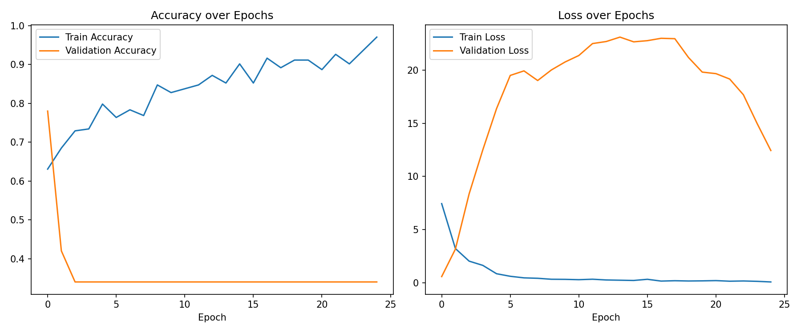
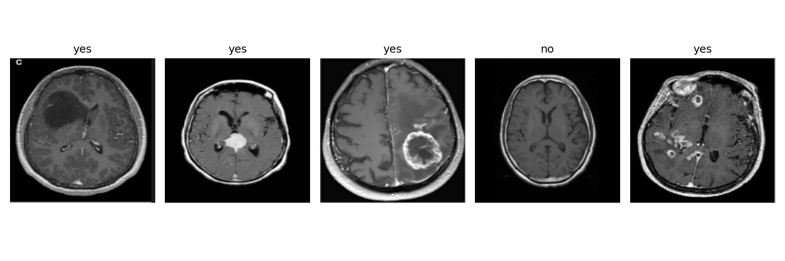

# Cancer Detection using MRI Images — CNN (Brain Tumor Classification)

AI-ML Assignment 6

## Objective

Build a Convolutional Neural Network (CNN) that classifies a brain MRI scan as showing a tumor
("yes") or not ("no"), and evaluate how well the model performs — with particular attention to
recall on the tumor class, since in cancer detection a missed tumor (false negative) is far more
costly than a false alarm (false positive).

## Dataset

Brain MRI Images for Brain Tumor Detection (Kaggle):
https://www.kaggle.com/datasets/navoneel/brain-mri-images-for-brain-tumor-detection

The dataset ships as two folders of MRI images — `yes` (tumor present) and `no` (no tumor). It is
**not** included in this repository — download it from the Kaggle link above, unzip it, and point
`DATA_DIR` in `Assignment-6.py` / `Assignment-6.ipynb` at the folder that directly contains the
`yes` and `no` subfolders.

## Libraries Used

- `tensorflow` / `tensorflow.keras` — building and training the CNN, loading images directly from
  the folder structure via `image_dataset_from_directory`
- `numpy` — numerical operations
- `matplotlib` — plotting sample scans, training curves, confusion matrix, and ROC curve
- `scikit-learn` — classification report, confusion matrix, ROC curve/AUC utilities

## Methodology

1. **Data Understanding** — counted images in the `yes`/`no` folders, loaded them via
   `image_dataset_from_directory` (grayscale, resized to 150x150), and displayed sample MRI scans
   with their labels.
2. **Data Preprocessing**
   - Used Keras's built-in 80/20 train/validation split directly from the directory structure
     (this validation split doubles as the held-out test set for evaluation).
   - Normalized pixel values from `[0, 255]` to `[0, 1]`.
   - Applied light data augmentation (horizontal flip, small rotation/zoom) to the training set
     only, since medical imaging datasets like this one are small and prone to overfitting.
3. **Model Development** — built a CNN with three convolutional blocks (Conv2D + Batch
   Normalization + MaxPooling + Dropout, increasing from 32 to 128 filters) followed by a dense
   classification head with a single sigmoid output (tumor probability), trained for 25 epochs
   with the Adam optimizer and binary cross-entropy loss.
4. **Model Evaluation** — computed Accuracy, Precision, Recall, F1 (via the classification
   report), ROC-AUC, and generated a confusion matrix and ROC curve.

## Results

**Important note on this repository's numbers:** the notebook was authored and syntax-checked,
but could not actually be *executed* in the environment used to write it, since that sandbox had
no internet access (so the Kaggle dataset couldn't be downloaded) and no TensorFlow installed. Run
this in Google Colab, Kaggle Notebooks, or any machine with `pip install tensorflow`, the dataset
downloaded, and internet access, then fill in the table below with your real results:

| Metric | Value |
|---|---|
| loss | 28.7632 |
| compile_metrics | 0.6400 |
| roc_auc | 0.6390 |

## Output images

----------------

**Observations**
- Recall on the tumor ("yes") class is the metric to watch most closely — a false negative here
  means a missed tumor, which is far more costly clinically than a false positive.
- This dataset is small (a few hundred images total), so expect some variance between runs and
  watch the train/validation accuracy gap for signs of overfitting; the augmentation and dropout
  layers are there to help mitigate this.
- The ROC curve and AUC give a threshold-independent view of separability between the two
  classes, which is useful since the default 0.5 decision threshold may not be the best choice
  for a screening tool where missing a tumor is especially costly (a lower threshold trades some
  precision for higher recall).

## Conclusion

This project built a Convolutional Neural Network to detect the presence of a brain tumor from
MRI scans, framed as a binary classification problem (tumor vs. no tumor). After loading images
directly from the Kaggle folder structure, normalizing pixel values, and applying light data
augmentation to help the model generalize despite the small dataset size, a CNN with three
convolutional blocks (Conv2D + batch normalization + max pooling + dropout) followed by a dense
classification head was trained to distinguish tumor-positive from tumor-negative scans. Beyond
raw accuracy, recall on the tumor class and the ROC-AUC score were emphasized, since in a medical
screening context a missed tumor is far more costly than a false alarm. Key factors affecting
performance are likely to include image quality/contrast, tumor size and location within the
scan, and the relatively small size of this dataset. One clear limitation of this CNN approach is
that it treats each 2D MRI slice independently and does not use full 3D volumetric context that
radiologists rely on, and with only a few hundred images total, the model is more prone to
overfitting and may not generalize well to scans from different MRI machines or imaging
protocols; a larger, more diverse dataset or transfer learning from a model pretrained on medical
images would likely improve robustness.
