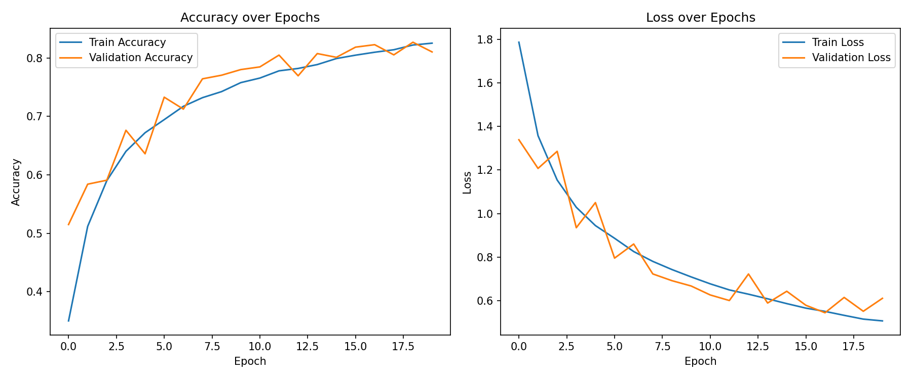

# CIFAR-10 Image Classification — Convolutional Neural Network

AI-ML Assignment 4

## Objective

Build a Convolutional Neural Network (CNN) that classifies 32x32 color images into one of 10
categories (airplane, automobile, bird, cat, deer, dog, frog, horse, ship, truck), and evaluate
how well the model performs.

## Dataset

CIFAR-10 — a standard benchmark dataset of 60,000 32x32 color images (50,000 train / 10,000
test) across 10 classes:
https://www.cs.toronto.edu/~kriz/cifar.html
(also mirrored on Kaggle: https://www.kaggle.com/c/cifar-10)

No manual download is required — the notebook loads it directly via
`tf.keras.datasets.cifar10.load_data()`, which downloads and caches the dataset automatically the
first time it runs (requires internet access on that first run).

## Libraries Used

- `tensorflow` / `tensorflow.keras` — building and training the CNN
- `numpy` — numerical operations
- `matplotlib` — plotting sample images, training curves, and the confusion matrix
- `scikit-learn` — classification report and confusion matrix utilities

## Methodology

1. **Data Understanding** — loaded CIFAR-10 via Keras, inspected the shapes of the train/test
   sets, and displayed the first five images with their class labels.
2. **Data Preprocessing**
   - Verified there are no missing/corrupt values (CIFAR-10 is a clean, complete dataset).
   - Normalized pixel values from `[0, 255]` to `[0, 1]`.
   - One-hot encoded the 10 class labels.
   - Used Keras's built-in 50,000/10,000 train/test split (CIFAR-10's standard split).
3. **Model Development** — built a CNN with three convolutional blocks (Conv2D + Batch
   Normalization + MaxPooling + Dropout, increasing from 32 to 128 filters) followed by a dense
   classification head, trained for 20 epochs with the Adam optimizer.
4. **Model Evaluation** — computed test loss/accuracy, a full classification report
   (precision/recall/F1 per class), plotted training/validation accuracy and loss curves, and
   generated a confusion matrix.

## Results

| Metric | Value |
|---|---|
| Test Accuracy | |
| Test Loss |  |

**Observations (update after running with your actual confusion matrix/curves):**
- Visually similar animal classes (e.g., cat/dog, deer/horse) are typically the most commonly
  confused pairs.
- Watch the gap between training and validation accuracy across epochs — a widening gap signals
  overfitting.
- Vehicle/object classes (airplane, automobile, ship, truck) tend to classify more reliably than
  animal classes, since their shapes and backgrounds are usually more visually distinct.

  

## Conclusion

This project built a Convolutional Neural Network to classify CIFAR-10 images into 10 categories
spanning vehicles and animals. After normalizing pixel values to the [0, 1] range and one-hot
encoding the class labels, a CNN with three convolutional blocks (each pairing Conv2D layers with
batch normalization, max pooling, and dropout) followed by a dense classification head was
trained for 20 epochs. The model learns hierarchical visual features — edges and textures in
early layers, and more complex object parts in deeper layers — which is what allows a CNN to
outperform a plain fully-connected network on image data. The most consistent source of error is
expected to be visually similar animal classes (e.g., cat vs. dog), since fine-grained texture and
pose differences are harder to capture at CIFAR-10's low 32x32 resolution. One clear limitation of
this approach is that CNNs of this size need a substantial number of training epochs and images to
generalize well, and can still struggle with classes that share similar colors, backgrounds, or
silhouettes; deeper architectures, data augmentation, or transfer learning from a pretrained
network would likely push accuracy higher still.
