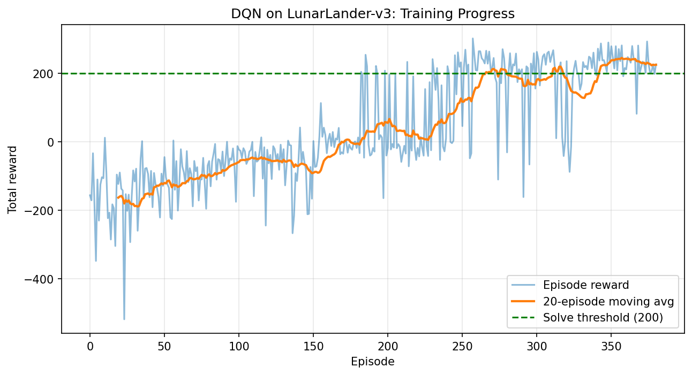

# LunarLander-v3 — Deep Q-Network (DQN) Agent

A self-contained, single-file implementation of a Deep Q-Network (DQN) agent that solves the **LunarLander-v3** environment from Gymnasium. 

## Project Overview

LunarLander is a classic control problem: a lander must fire its main and side thrusters to descend and land safely between two flags on the moon's surface, without crashing, tipping over, or running out of fuel considerations (fuel itself is unlimited, but excessive thruster use is penalized).

- **Observation space:** 8 continuous values (x/y position, x/y velocity, angle, angular velocity, left/right leg ground contact)
- **Action space:** 4 discrete actions (do nothing, fire left orientation engine, fire main engine, fire right orientation engine)
- **Reward:** Shaped reward based on proximity to the landing pad, velocity, angle, leg contact, and engine usage; +100 for a safe landing, -100 for a crash
- **Solved condition:** average reward ≥ 200 over 100 consecutive episodes

This project trains a DQN agent — a neural network that approximates the Q-value function — to solve this environment using experience replay and a target network for stable learning.

## Files

| File | Description |
|---|---|
| `lunarlander_dqn.py` | Complete training script: installs dependencies, defines the DQN agent, trains it, evaluates it, plots results, and saves outputs |
| `README.md` | This file |

## How It Works

1. **Q-Network** — A feed-forward neural network (8 → 128 → 128 → 4) that maps a state to Q-values for each of the 4 actions.
2. **Replay Buffer** — Stores past transitions `(state, action, reward, next_state, done)` and samples random mini-batches to break correlation between consecutive experiences.
3. **Target Network** — A slowly-updated copy of the Q-network used to compute stable targets, reducing training instability.
4. **Epsilon-Greedy Exploration** — The agent starts by acting mostly randomly (epsilon ≈ 1.0) and exponentially decays toward mostly-greedy behavior (epsilon ≈ 0.01). LunarLander needs a longer exploration schedule than CartPole since the state/action space is more complex.
5. **Training Loop** — Runs up to 1200 episodes, performing a gradient update after every environment step once enough experience has been collected, and stops early once the environment is considered solved.
6. **Evaluation** — After training, the agent is run greedily (no exploration) for 20 episodes to measure final performance.
7. **Results Saving** — Model weights, reward logs, evaluation scores, a training curve image, and a text summary are all saved to a timestamped folder.

## Output / Results

At the end of a run you'll see:
- A **reward-per-episode plot** with a 20-episode moving average and the solve threshold marked
- Printed **evaluation scores** (list of 20 episode rewards) plus their mean, standard deviation, max, and min
- A saved **results folder** (`lunarlander_results/run_<timestamp>/`) containing:
  - `dqn_lunarlander.pth` — trained model weights
  - `episode_rewards.csv` — reward for every training episode
  - `eval_scores.csv` — reward for every evaluation episode
  - `training_curve.png` — the reward plot as an image
  - `summary.txt` — final performance summary

## Key Hyperparameters

| Parameter | Value |
|---|---|
| Discount factor (gamma) | 0.99 |
| Learning rate | 5e-4 |
| Batch size | 128 |
| Replay buffer size | 100,000 |
| Epsilon start / end | 1.0 / 0.01 |
| Epsilon decay | ~20,000 steps |
| Target network update frequency | every 1000 gradient steps |
| Max episodes | 1200 |
| Max steps per episode | 1000 |

## Possible Extensions

- Swap DQN for Double DQN or Dueling DQN — these typically help a lot with LunarLander's overestimation issues
- Try Prioritized Experience Replay to speed up learning from rare, high-value transitions
- Try Stable-Baselines3's PPO or A2C for a comparison baseline
- Record a video of the trained agent using `gymnasium`'s `RecordVideo` wrapper
- Try the continuous-action variant, `LunarLanderContinuous-v3`, with an actor-critic method like DDPG, TD3, or SAC (DQN only supports discrete actions)
